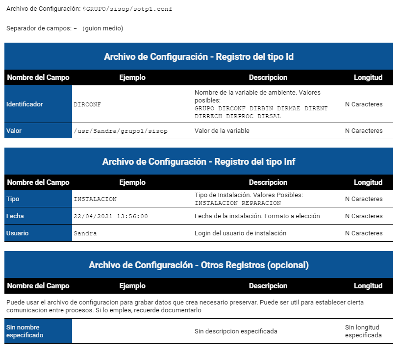

# TP 1

- [TP 1](#tp-1)
  * [Fechas de Interés](#fechas-de-interés)
  * [Información para el TP](#información-para-el-tp)
  * [Trabajo a Realizar](#trabajo-a-realizar)
    + [Condiciones de Desarrollo y Entrega](#condiciones-de-desarrollo-y-entrega)
- [Enunciado](#enunciado)
    + [Descripción](#descripción)
  * [Autoevaluación](#autoevaluación)
  * [Punto uno. README / Descarga](#punto-uno-readme--descarga)
    + [Respecto del README](#respecto-del-readme)
    + [Respecto de la descarga](#respecto-de-la-descarga)
    + [Autoevaluación](#autoevaluación-1)
  * [Punto dos. Documentación](#punto-dos-documentación)
    + [Autoevaluación](#autoevaluación-2)
  * [Punto tres. Script de Instalación: `sotp1`](#punto-tres-script-de-instalación-sotp1)
    + [Propósito](#propósito)
  * [Layout del Archivo de Configuración](#layout-del-archivo-de-configuración)
  * [Layout del Archivo de Log](#layout-del-archivo-de-log)
    + [Autoevaluación](#autoevaluación-3)
  * [Punto cuatro. Script Inicializador `soinit`](#punto-cuatro-script-inicializador-soinit)
    + [Propósito](#propósito-1)
    + [Invocación del script](#invocación-del-script)
    + [El comando debe soportar los siguientes escenarios](#el-comando-debe-soportar-los-siguientes-escenarios)
    + [Verificar la instalación](#verificar-la-instalación)
    + [Verificar directorios de la instalación](#verificar-directorios-de-la-instalación)
    + [Verificar archivos necesarios para ejecutar](#verificar-archivos-necesarios-para-ejecutar)
    + [Verificar permisos](#verificar-permisos)
    + [Variables de ambiente](#variables-de-ambiente)
    + [Arrancar el proceso](#arrancar-el-proceso)
    + [Informar process id](#informar-process-id)
    + [Informar como detener y arrancar el proceso](#informar-como-detener-y-arrancar-el-proceso)
    + [Grabar log mientras se ejecuta el script](#grabar-log-mientras-se-ejecuta-el-script)
    + [Autoevaluación](#autoevaluación-4)
  * [Punto cinco. Proceso Principal `tpcuotas`](#punto-cinco-proceso-principal-tpcuotas)
    + [Propósito](#propósito-2)
    + [Tipo de proceso](#tipo-de-proceso)
    + [Verificar Inicialización](#verificar-inicialización)
    + [Contar ciclos](#contar-ciclos)
    + [Lectura de novedades](#lectura-de-novedades)
    + [Condiciones de aceptabilidad](#condiciones-de-aceptabilidad)
    + [¿Qué se hace cuando un archivo no es aceptable?](#qué-se-hace-cuando-un-archivo-no-es-aceptable)
    + [¿Cuándo el nombre del archivo es correcto?](#cuándo-el-nombre-del-archivo-es-correcto)
    + [¿Cómo se determina que un archivo está duplicado?](#cómo-se-determina-que-un-archivo-está-duplicado)
    + [¿Qué se hace cuando un archivo es aceptable?](#qué-se-hace-cuando-un-archivo-es-aceptable)
    + [Lectura de novedades aceptadas](#lectura-de-novedades-aceptadas)
    + [Control de Registros de Entrada](#control-de-registros-de-entrada)
    + [Validaciones](#validaciones)
    + [Salida](#salida)
    + [Registro de Salida: Sin Cuotas](#registro-de-salida-sin-cuotas)
    + [Registro de Salida: Con cuotas, Sin Interes](#registro-de-salida-con-cuotas-sin-interes)
    + [Registro de Salida: Con cuotas, Con Financiación](#registro-de-salida-con-cuotas-con-financiación)
    + [Calcular el costo de financiación](#calcular-el-costo-de-financiación)
    + [Calcular la fecha de la cuota](#calcular-la-fecha-de-la-cuota)
    + [Contadores](#contadores)
    + [Evitar Reprocesos](#evitar-reprocesos)
    + [Fin de Ciclo](#fin-de-ciclo)
    + [Layout del Archivo de Terminales](#layout-del-archivo-de-terminales)
    + [Layout del Archivo de Coeficientes](#layout-del-archivo-de-coeficientes)
    + [Layout del Archivo de Transacciones](#layout-del-archivo-de-transacciones)
    + [Layout del Archivo de Liquidación](#layout-del-archivo-de-liquidación)
    + [Layout del Archivo de Transacciones rechazadas](#layout-del-archivo-de-transacciones-rechazadas)
    + [Autoevaluación](#autoevaluación-5)
  * [Punto seis. `arrancotp1` - `frenotp1`](#punto-seis-arrancotp1---frenotp1)
    + [`frenotp1`](#frenotp1)
    + [`arrancotp1`](#arrancotp1)
    + [Autoevaluación](#autoevaluación-6)

## Fechas de Interés
|         Fecha         |        Info              |
|-----------------------|--------------------------|
|martes, junio 15, 2021 | VENCIMIENTO TP1          |
|martes, junio 22, 2021	| PARCIAL                  |
|martes, junio 29, 2021	| EXPLICACIÓN DE TP2       |
|martes, julio 06, 2021	| Entrega de Notas Parcial |
|martes, julio 13, 2021	| Recuperatorio 1          |
|martes, julio 20, 2021	| Entrega de notas R1      |
|martes, julio 27, 2021	| Recuperatorio 2          |
|jueves, julio 29, 2021	| VENCIMIENTO TP2          |
|jueves, julio 29, 2021	| Entrega de Notas R2      |
[](https://www.notion.so/40d1a9a39406471391a00d8b8d848c77)

## Información para el TP

En este Word se encuentra el enunciado del TP y la autoevaluación

En el [Excel](https://docs.google.com/spreadsheets/d/1U7mL0PrVtX9xIQ2u-1sTiCJOjbJrc0dm) se encuentra

- El diseño de las estructuras de entrada y salida
- Los datos para armar las tablas de parámetros
- Ejemplos
- Los datos para armar los sets de prueba

**Contacto: [sabraham@fi.uba.ar](mailto:sabraham@fi.uba.ar)**

## Trabajo a Realizar

- Se debe documentar en un **README** todo lo necesario para poder descargar, instalar y ejecutar el sistema.
- Se debe crear un paquete de descarga con la estructura solicitada.
- Se debe documentar lo solicitado.
- Se debe realizar un script para realizar la instalación/reparación del sistema.
- Se debe realizar un script inicializar el entorno de ejecución del proceso.
- Se debe realizar un script para realizar el trabajo principal: leer la entrada y grabar la salida.
- Se deben realizar dos comandos complementarios para arrancar el proceso principal y frenar el proceso principal.

### Condiciones de Desarrollo y Entrega

- Todos los comandos deben ser desarrollados en Shell script
- Todo el sistema debe poder ser ejecutado **SIN SER ROOT**
- La documentación es obligatoria
    - El **README** debe ser un documento aparte
    - El resto de la documentación del sistema puede estar en este documento o en un documento aparte
    - Se debe realizar una autoevaluación y registrarla en este documento
- Las pruebas son obligatorias
    - Se debe lograr la ejecución de todo el sistema y dar evidencia de ello
- Se debe entregar el TP antes del 15 de junio de 2021 a las 19 horas.
    - Toda la entrega debe estar subida a un repositorio (como GitHub) y dar acceso a [sabraham@fi.uba.ar](mailto:sabraham@fi.uba.ar)
    - Se debe enviar mail a [sabraham@fi.uba.ar](mailto:sabraham@fi.uba.ar) con el link, adjuntar el archivo README y este documento completo con la autoevaluación realizada

# Enunciado

### Descripción

Se reciben lotes con información de transacciones efectuadas con tarjetas de crédito, tarjetas de débito o tarjetas prepagas. 

Ejemplo de registro de entrada


Nombre del Campo        | Ejemplo
----------------------- | -------
Nro. de Registro        | 0001
Código de Comercio      | C10102
Código de Terminal      | T1558
Fecha de Compra         | 20210405
Hora de Compra          | 150115
Código de Rubro         | HERRAM
Cantidad de Cuotas      | 006
Monto de la Transacción | 000000226329
Nro. Transacción        | 001011140048
PAN-primeros 6          | 417825
PAN-últimos 4           | 7307
Vencimiento tarjeta     | 2210
Nro de Cupon            | 0286
Código de Autorización  | 101465


```markdown
/* Equivalente en un csv */
0001,C10102,T1558,20210405,150115,HERRAM,006,000000226329,001011140048,\
417825,7307,2210,0286,101465
```

El objetivo del TP es crear los **archivos de liquidación** de cada comercio: 

- por cada registro de entrada se deben grabar uno o mas registros dependiendo de la cantidad de cuotas

Cuando la venta es en cuotas se debe calcular el valor de cada cuota con la financiación incluida. Para conocer el coeficiente de financiación usar la tabla de `financiacion.txt` 

- para encontrar el coeficiente debemos buscar por rubro y cantidad de cuotas si encontramos ese registro es la financiación para el plan conocido como Ahora12 en Argentina
- Este plan establece el coeficiente en 3, 6, 12 o 18 cuotas según el rubro/tope
- Caso particular: que supere el tope. Si ocurre esto, no sirve ese coeficiente, seguir buscando como se indica en el siguiente punto
- Si no encontramos ese registro, debemos buscar con la cuota y el **Rubro** vacío
    - Si encontramos ese registro es la financiación de la entidad
- Si no encontramos nada, es “**sin interes**”

Para más información sobre el programa **ahora12**, visite:

- [https://www.argentina.gob.ar/produccion/ahora-12/rubros](https://www.argentina.gob.ar/produccion/ahora-12/rubros)
- [https://www.argentina.gob.ar/ahora-12/comerciantes](https://www.argentina.gob.ar/ahora-12/comerciantes)

Para simular la venta en cuotas visite:

[https://www.firstdata.com.ar/simulador.html](https://www.firstdata.com.ar/simulador.html) (No anda más)

## Autoevaluación

Responder con **SI – NO – NA**. Las filas sombreadas las responde el ayudante

- [ ]  1. (Para corrector) Entrega a tiempo
- [ ]  2. (Para corrector) Mail con link y permiso para [sabraham@fi.uba.ar](mailto:sabraham@fi.uba.ar)

---

## Punto uno. README / Descarga

### Respecto del README

Entregar un README en el cual se explican todos y cada uno de los pasos necesarios para acceder al TP, descargarlo, instalarlo y ejecutarlo

Ejemplo

```markdown
Guía para la detención manual del proceso principal

1. Abra una terminal y navegue hasta el directorio 
`grupo01` (donde se descargó el programa).
1.1. Tipee `cd grupo01`

2. Moverse al directorio de ejecucutables
2.1. Tipee `more ./so7508/instalarTP.conf` y en la línea
`DIRBIN` encontrará el __directorio de ejecutables__
```

### Respecto de la descarga

**DIRECTORIO DE TRABAJO**

Toda la descarga debe realizarse bajo un mismo directorio de trabajo llamado `GrupoN` donde `N` es su número de grupo.

Todo el camino (`path`) que va desde la raíz hasta `GrupoN` lo denominaremos genéricamente `$GRUPO` para facilitar la explicación del TP.

¿Por qué pedimos esto? Para evitar que las distintas resoluciones de cada grupo se mezclen.

**DIRECTORIO para el SCRIPT DE INSTALACIÓN**

Dentro de `$GRUPO` crear una carpeta `sisop` y depositar allí el **script de instalación.**

**DIRECTORIO para resguardar el paquete original**

Dentro de `$GRUPO` crear una carpeta `original` y depositar allí los **scripts originales** y las tablas maestras del sistema. Puede organizar la información con subcarpetas.

**DIRECTORIO para resguardar los datos de prueba de la catedra**

Dentro de `$GRUPO` crear una carpeta `tp1datos` y depositar allí los **archivos con los datos de prueba provistos por la catedra**. Puede organizar la información con subcarpetas

**DIRECTORIO para resguardar los datos de prueba propios**

Dentro de `$GRUPO` crear una carpeta `misdatos` y depositar allí los archivos con los datos de prueba propios. Puede organizar la información con subcarpetas

**DIRECTORIO para resguardar las evidencias de los testeos propios**

Dentro de `$GRUPO` crear una carpeta `mispruebas` y depositar allí **evidencias de las pruebas realizadas**. Puede organizar la información con subcarpetas pero respete estos nombres para que el ayudante pueda encontrar la información fácilmente

### Autoevaluación

- [ ]  1. El README, ¿nos dice correctamente que se debe descargar?
- [ ]  2. Una vez identificado el paquete ¿nos dice cómo se debe hacer la descarga?
- [ ]  34. Una vez hecha la descarga, ¿se crea automáticamente `GrupoN` y los demás solicitados?
- [ ]  4. ¿todo queda bajo `$GRUPO`?
- [ ]  5. (Para corrector) ¿Fue suficiente la explicación del `README` para descargar el sistema?
- [ ]  6. (Para corrector) ¿Se recibió la última versión?
- **Respecto de la instalación**
- [ ]  7. El README, ¿explica los pasos para lograr instalar? Logueo, ejecución
- [ ]  8. El README, ¿explica qué deja la instalación? ¿Dónde lo deja?
- [ ]  9. El README, ¿explica que se debe hacer si hay que reparar la instalación?
- [ ]  10. (Para corrector) ¿Fue suficiente la explicación del README para hacer la instalación?
- **Respecto de la inicialización**
- [ ]  11. ¿El README brinda las instrucciones correctas para ejecutar el inicializador?
- [ ]  12. ¿El README brinda las instrucciones correctas para detener o arrancar?
- [ ]  13. (Para corrector) ¿Fue suficiente la explicación del README?
- **Respecto del proceso**
- [ ]  14. ¿El README brinda las instrucciones para efectuar una prueba completa?
- [ ]  15. (Para corrector) ¿Fue suficiente la explicación del README para hacer una prueba completa?

## Punto dos. Documentación

Se puede documentar en este mismo documento o bien en un documento aparte.

Indique a continuación que decide: _______________________________________________

Si documenta acá, actualice la tabla de contenido de la página 2 para que se muestran los ítems que agregan.

La autoevaluación es explicativa de lo solicitado

### Autoevaluación

- [ ]  1. ¿Coloca número de grupo y quienes participaron realmente en la resolución?
- [ ]  2. ¿Tiene la autoevaluación completa? Indicar:
    - SI, cuando la entrega cumple con lo solicitado y da evidencia de ello
    - NO, si no cumple con lo solicitado o no puede dar evidencia de ello
    - NA, si el ítem no aplica a su solución
- [ ]  3. Hipótesis y Aclaraciones

    En un ítem bajo este título ¿están documentadas las hipótesis y aclaraciones que han asumido en la resolución del TP?

- [ ]  4. Descripción de Problemas

    En un ítem bajo este título ¿están documentadas las dificultades que atravesaron durante el desarrollo del TP y cómo lograron resolverlas?

- [ ]  5. Comandos Adicionales ¿ha creado nuevos comandos?

    Si crea algún comando auxiliar, ¿está documentado nombre y para que lo usa?

    Si no realiza comandos auxiliares indique “NA”

- [ ]  6. Archivos Adicionales ¿ha creado nuevos archivos permanentes?

    Si crea algún archivo, ¿está documentado nombre y para que lo usa?

    Si no crea nuevos archivos, indique “NA”

- [ ]  7. Estructura de Directorios – parte 1

    En un ítem bajo este título ¿está documentada la estructura resultante luego de una instalación y una ejecución?

- [ ]  Estructura de Directorios – parte 2

    En la rama que contiene los archivos de prueba propios, listar el nombre de cada archivo y para que se usa

    Por ejemplo:

    - Lote10102_01: contiene registros con error de formato
    - Lote10102_02: contiene registros sin terminal, sin comercio, comercio no existe
    - Lote10102_03: archivo vacio
    - Lote10102_04: archivo no contiene texto
- [ ]  8. (Para corrector) Las decisiones tomadas durante el desarrollo ¿Fueron bien documentadas?

## Punto tres. Script de Instalación: `sotp1`

### Propósito

El propósito de este comando es realizar la instalación o reparación del sistema

**El comando debe soportar los siguientes escenarios:**

- El sistema nunca fue instalado ⇒ se deberá instalar el sistema
- El sistema está bien instalado ⇒ Se deberá mostrar los datos del archivo de configuración y no se deberá instalar el sistema
- El sistema está instalado pero incompleto
    - Se deberá informar al usuario lo que esta mal
    - Si se puede reparar, avisar y hacerlo, luego mostrar los datos del archivo de configuración
    - Si no se puede reparar decirle al usuario qué debería hacer para solucionar el problema

**¿Cómo saber si está instalado?**

Si el archivo de configuración del sistema EXISTE, deben asumir que ya fue instalado.

Este archivo lo graba este instalador en `$GRUPO/sisop/sotp1.conf`

**¿Cuál es el alcance de una reparación?**

Una reparación no modifica los identificadores del archivo de configuración.

Toma lo que hay en éste y con la información de la carpeta original reconstruye lo que falta

- Copia algún archivo que falte
- Crea algún directorio que falte

Pero todo ello basándose en el archivo de configuración existente, no crea uno nuevo.

**Inicio de la instalación, solicitar nombres de directorios**

Solicitar al usuario que defina

1. El directorio de ejecutables (por default proponer el directorio `/bin`)
2. El directorio de tablas del sistema (por default proponer el directorio `/master`)
3. El directorio de novedades, es decir, el directorio donde “arriban” los archivos que nos mandan los comerciantes (por default proponer el directorio `/ENTRADATP`)
4. El directorio para los archivos rechazados (por default proponer el directorio `/rechazos`)
5. El directorio de lotes ya procesados (por default proponer el directorio `/lotes`)
6. El directorio de resultados, es decir, el directorio donde se depositan los archivos de output (por default proponer el directorio `/SALIDATP`)

**Evitar el uso de nombres reservados**

No permitir el uso de nombres tales como:

- `GrupoN`
- `sisop`
- `original`
- `tp1datos`
- `misdatos`
- `mispruebas`

**Evitar nombres duplicados**

No permitir que el usuario designe el mismo nombre a distintos directorios, el usuario puede poner cualquier nombre, pero no siempre el mismo.

**Mas sobre los directorios de la instalación**

- Si quieren pueden reservarse mas nombres, poner sus propias reglas acerca de que se permite como nombre y que no se permite. Todas estas cuestiones las tienen que documentar en hipótesis.
- Si el usuario ingresa un directorio incorrecto, indicarle al usuario el error y volver a mostrar el valor default para que acepte ese valor o ingrese uno nuevo
- En todos los casos, cuando se interactúa con el usuario se debe proponer un valor por default

**Confirmación de la instalación**

Cuando el usuario termina de configurar los nombres de directorios, mostrarle por pantalla donde van a quedar los logs, como va a quedar la estructura y solicitarle que confirme para continuar. Por ejemplo:

```markdown
TP1 SO7508 1º Cuatrimestre 2021 Curso Martes Copyright © Grupo N
Tipo de proceso:                 INSTALACION o REPARACION
Directorio padre:                $GRUPO
Ubicación script de instalación: $GRUPO/sisop/sotp1.sh
Log de la instalación:           $GRUPO/sisop/sotp1.log
Archivo de configuración:        $GRUPO/sisop/sotp1.conf
Log de la inicialización:        $GRUPO/sisop/soinit.log
Log del proceso principal:       $GRUPO/sisop/tpcuotas.log
Directorio de ejecutables:       $GRUPO/bin
Directorio de tablas maestras:   $GRUPO/master
Directorio de novedades:         $GRUPO/ENTRADATP
*Directorio novedades aceptadas: $GRUPO/ENTRADATP/ok
Directorio de rechazados:        $GRUPO/rechazos
Directorio de lotes procesados:  $GRUPO/lotes
Directorio de liquidaciones:     $GRUPO/SALIDATP
Estado de la instalación:        LISTA
¿Confirma la instalación? (SI-NO): _
```

**Confirmación de la reparación**

Cuando se trata de una reparación, también mostrar la información precedente y solicitarle que confirme para continuar.

**No confirma la instalación**

Si el usuario indica `No`, volver a solicitar los directorios, pero esta vez mostrando como default el valor que le dio el usuario recientemente, es decir, que el script debe tener memoria de los valores ingresados previamente.

**No confirma la reparación**

Si el usuario indica `No`, terminar el script mostrando un mensaje explicativo.

**Si confirma la instalación**

- Si el usuario indica **Si** crear la estructura de directorios y copiar cada archivo al lugar correspondiente.
- No debe crear ningún directorio hasta no tener la confirmación de la instalación.
- *la carpeta `/ok` es un subdirectorio del directorio de `ENTRADATP` señalado por el usuario.

**Si confirma la reparación**

Si el usuario indica **Si** crear la estructura faltante, copiar el archivo faltante al lugar correspondiente, etc.

**Crear el archivo de configuración del sistema – solo para instalación**

Grabar 8 registros con los identificadores y su valor

```markdown
GRUPO	con el path completo desde la raíz hasta el directorio grupoxx
DIRCONF	con el directorio sisop
DIRBIN	con el directorio de ejecutables
DIRMAE	con el directorio de tablas maestras
DIRENT	con el directorio de arribo de las novedades
DIRRECH	con el directorio de rechazados
DIRPROC	con el directorio de procesados
DIRSAL	con el directorio de salida
```

Grabar un registro con tipo=`INSTALACIÓN`, fecha y usuario de la instalación.

**Grabar en el archivo de configuración la información de la reparación**

Cuando es reparación grabar un registro con tipo=REPARACION, fecha y usuario de la reparación.

**Grabar log mientras se ejecuta el script**.

El log no debe reescribirse, siempre se le agregan registros, aun cuando se produce una cancelación o reparación.

Todo lo que se muestra al usuario por pantalla y sus respuestas debe ser registrado en el log `sotp1.log`.

La estructura resultante que se le muestra al usuario para confirmar la instalación, se debe registrar en el log.

A medida que se hace la creación de directorios y su llenado también se debe registrar en el log.

- Mostrar mensaje de éxito del proceso de instalación tanto por pantalla como en el log.

Estado de la instalación:        `COMPLETADA`

- Mostrar mensaje de éxito del proceso de reparación tanto por pantalla como en el log.

Estado de la instalación:        `REPARADA`

> ¿Qué es un log?
Un log es un registro oficial de eventos durante un periodo de tiempo en particular.
Es usado para registrar información sobre cuándo, quién, dónde, qué y por qué un evento ocurre para una aplicación, proceso o dispositivo.
A estos 5 valores se los llama estándar W5, por su origen en inglés: **when**, **who**, **where**, **what** and **why**.

## Layout del Archivo de Configuración

El archivo de configuración contiene al menos dos tipos de registros

- Ocho registros con los identificadores
- 1 Registro con Información Adicional (Fecha y hora de la instalación)



## Layout del Archivo de Log

Hay al menos tres archivos de log: 

- log de la instalación
- log del inicializador
- log de **tpcuotas.**

Los registros del log tanto para el log de la instalación como para el resto de los scripts deben ser iguales en su formato, y deben registrar al menos: 

- Tipo
- Fecha y hora
- Mensaje (en ese orden)

Pueden agregarse: 

- Origen (qué comando, script, función o rutina es el que produce el evento que se registra en el log)
- Usuario


### Autoevaluación

- [ ]  1. ¿el instalador detecta cuando el sistema no está instalado?
- [ ]  2. ¿el instalador detecta cuando el sistema está bien instalado?
- [ ]  3. ¿el instalador detecta cuando el sistema necesita reparación?
- [ ]  4. ¿se pueden configurar los nombres de los directorios?
- [ ]  5. ¿propone valores **default**?
- [ ]  6. ¿evita el uso de `sisop`?
- [ ]  7. ¿evita nombres duplicados? Ejemplo: `/misarchivos` (para el de ejecutables) `/misarchivos` (para las novedades)
- [ ]  8. ¿hay restricciones documentadas acerca de que se puede usar como nombre? Indique dónde documenta esto
- [ ]  9.En particular ¿se pueden usar nombres con espacios intermedios?

    Si indica SI, pase al siguiente punto; Si indica NO, indique dónde manifiesta la restricción

- [ ]  10. En particular, sub-subcarpetas ¿se pueden usar y no causan problemas durante la instalación o después?

    Si indica SI, pase al siguiente punto; Si indica NO, indique dónde manifiesta la restricción

- [ ]  11. ¿Funciona la confirmación de la instalación o la reparación?
- [ ]  12. Si la instalación no se confirma ¿se reinicia el proceso?
- [ ]  13. Si la instalación no se confirma ¿tiene memoria de lo que fue cargando previamente el usuario? ¿muestra correctamente los defaults?
- [ ]  14. Si la instalación se confirma ¿crea los directorios en ese momento y mueve los archivos a su lugar?
- [ ]  15. ¿crea el archivo de configuración con el contenido solicitado y el formato de registro indicado?
- [ ]  16. Si la reparación se confirma, ¿lo repara y graba la fecha en el archivo de configuración?
- [ ]  17. Durante toda la ejecución, ¿graba en el log toda la interacción entre el usuario y el script tanto cuando la instalación es exitosa como cuando la instalación es cancelada o reparada?
- [ ]  18. ¿se conserva el log aun luego de una reparación?
- [ ]  19. Se entregan evidencias del testeo previo de este script (log de una instalación exitosa, archivo de configuración)
- [ ]  20. (Para corrector) ¿Es reproducible la evidencia entregada?

## Punto cuatro. Script Inicializador `soinit`

### Propósito

El propósito de este comando es:

- preparar el entorno de ejecución del TP (variables de ambiente)
- asegurar que estén dadas todas las condiciones para la ejecución del sistema (que existan los scripts y las tablas maestras, que estén los permisos, que estén los directorios)
- invocar al proceso principal

> ¿Por qué existe esto? La idea es que al no ser root sean capaces de armar un sistema que puede ser ejecutado con independencia de la configuración que tenga el usuario, o lo que se tiene en los archivos `.profile` y en el `PATH`.
El inicializador les tiene que brindar esa independencia.

La lógica del proceso completo es que cierto usuario en algún momento realiza la instalación
Otro usuario en otro momento necesita poner en funcionamiento el sistema.

Para hacerlo la condición que se impondrá es que antes de ejecutar el proceso principal se tiene que realizar la inicialización del ambiente.

Explique en las hipótesis como logra que el proceso principal no se ejecute sin la inicialización previa.??

La inicialización dura mientras dura la conexión con la terminal, si la terminal se cierra, se vuelve al estado inicial

### Invocación del script

Un punto clave en este script es su forma de invocación, la cual debe asegurar que cuando invoca al proceso principal no se generen sub-shells, si esto ocurre el valor de las variables de ambiente pierden visibilidad en el proceso principal

Recuerde documentar correctamente la forma de invocación de este script en el README

### El comando debe soportar los siguientes escenarios

- El usuario se loguea y solicita inicializar
    - se deberá inicializar el sistema
- Dentro de la misma sesión del usuario, nuevamente se solicita inicializar
    - Si el proceso principal esta corriendo, Informar que si se quiere iniciar de nuevo, antes debe detener el proceso con `frenotp1`
    - Si el proceso principal no esta corriendo, pero la inicialización sigue vigente, Informar que si se quiere arrancar el proceso debe hacerlo con `arrancotp1` y si lo que quiere es inicializar debe cerrar la sesión y loguearse de nuevo.
- Al intentar inicializar el sistema, se detecta un error en la instalación
    - No se debe completar exitosamente la inicialización y se debe informar que debe invocar `sotp1` para reparar el sistema

Los pasos de esta explicación son a modo indicativo, se puede alterar el orden siempre y cuando no se altere el propósito del script

### Verificar la instalación

Leer el archivo `sotp1.conf`

Si no existe

- Informar al usuario el error severo
- Brindar una explicación de los pasos que debe seguir
- terminar

### Verificar directorios de la instalación

Leer el archivo `sotp1.conf` y verificar que todos esos directorios existen

Si se detecta que alguno de estos directorios no existe:

- Informar al usuario de la situación, que es lo que está faltando
- Brindar una explicación de los pasos que debe seguir para reparar la instalación
- terminar

> Avisar por pantalla y registrar en el `log` si los directorios están verificados ok

### Verificar archivos necesarios para ejecutar

Ir al directorio de tablas maestras y verificar que existan

Si se detecta algún faltante:

- Informar al usuario de la situación, que es lo que está faltando
- Brindar una explicación de los pasos que debe seguir para reparar la instalación
- terminar

> Avisar por pantalla y registrar en el `log` si están verificados ok

### Verificar permisos

Los archivos del directorio de **tablas maestras** deben tener permiso de lectura

- Si se detecta algún faltante: corregir el permiso

Los archivos del directorio de ejecutables deben tener permiso de ejecución

- Si se detecta algún faltante: corregir el permiso

> Avisar por pantalla y registrar en el `log` el ok de permisos

### Variables de ambiente

- Todos los identificadores del archivo de configuración deben convertirse en variables de ambiente
- Estas variables deben permanecer durante toda la ejecución del sistema y ser accesibles por el proceso principal y otros comandos relacionados
- El único que lee el archivo de configuración es **este script**, el resto de los comandos trabajan con las variables de ambiente directamente.
- Cuando las variables de ambiente están configuradas, mostrar un mensaje por pantalla y en el `log`

### Arrancar el proceso

**Invocar al script** `tpcuotas`

> ⚠️ ADVERTENCIA: no invocar el proceso si ya hay uno corriendo. Avisar cuando pasa eso

### Informar process id

Informar por pantalla y en el log el process id que le asignó el sistema operativo

### Informar como detener y arrancar el proceso

informar por pantalla que si se quiere detener el proceso se debe usar `frenotp1`
informar por pantalla que si luego se quiere arrancar hay que hacerlo con `arrancotp1`

### Grabar log mientras se ejecuta el script

Todo lo que va sucediendo durante la inicialización se debe grabar en `$GRUPO/sisop/soinit.log`

El log no debe reescribirse, debe conservar la historia

El Diseño del registro de log se encuentra detallado en el punto anterior, el script de instalación, debe respetarse ese formato en todo el sistema

### Autoevaluación

- [ ]  1. ¿Hay Indicación correcta en el README de como se ejecuta este script?
- [ ]  2. ¿el comando detecta cuando el sistema nunca fue inicializado y lo inicializa?
- [ ]  3. ¿detecta cuando el sistema ya fue inicializado exitosamente y no reinicializa?¿explica la situación? ¿graba en el log?
- [ ]  4. ¿resuelve correctamente la falta del archivo de configuración? ¿explica la situación? ¿graba en el log?
- [ ]  5. ¿resuelve correctamente la falta de algún directorio? ¿explica la situación? ¿graba en el log?
- [ ]  6. ¿resuelve correctamente la falta de algún archivo? ¿explica la situación y la graba en el log?
- [ ]  7. ¿brinda indicaciones para reparar la instalación?
- [ ]  8. ¿resuelve correctamente la falta de algún permiso? ¿graba en el log?
- [ ]  9. ¿setea correctamente las variables de ambiente?
- [ ]  10. ¿quedan visibles para el resto de los comandos las variables de ambiente?
- [ ]  11. ¿arranca el proceso?
- [ ]  12. ¿muestra el process id? ¿graba en el log?
- [ ]  13. ¿explica como se detiene el proceso?
- [ ]  14. ¿explica como se arranca el proceso?
- [ ]  15. Se entregan evidencias del testeo previo de este script (log)
- [ ]  16. (Para corrector) ¿Es reproducible la evidencia entregada?

## Punto cinco. Proceso Principal `tpcuotas`

### Propósito

El objetivo del script  es crear los archivos de liquidación de **cada comercio** 

- por cada registro de entrada se deben grabar uno o mas registros dependiendo de la cantidad de cuotas

Cuando la venta es en cuotas se debe calcular el valor de cada cuota con la financiación incluida.

Para conocer el coeficiente de financiación usar la tabla de `financiacion.txt`

- para encontrar el coeficiente debemos buscar por rubro y cantidad de cuotas
    - si encontramos ese registro es la financiación para el plan conocido como **Ahora12** en Argentina
    - Este plan establece el coeficiente en **3, 6, 12 o 18 cuotas** según el rubro/tope
    - Caso particular: que supere el tope si ocurre esto, no sirve ese coeficiente, seguir buscando como se indica en el siguiente punto
- si no encontramos ese registro, debemos buscar con la cuota y el Rubro vacío
    - Si encontramos ese registro es la financiación de la entidad si no encontramos nada, es “sin interes”

Para más información sobre el programa ahora 12, visite:

- [https://www.argentina.gob.ar/produccion/ahora-12/rubros](https://www.argentina.gob.ar/produccion/ahora-12/rubros)
- [https://www.argentina.gob.ar/ahora-12/comerciantes](https://www.argentina.gob.ar/ahora-12/comerciantes)

Para simular la venta en cuotas visite:

- [https://www.firstdata.com.ar/simulador.html](https://www.firstdata.com.ar/simulador.html)  (No anda más)

### Tipo de proceso

Este comando es un proceso del tipo demonio, `daemon` o dæmon (de sus siglas en inglés **Disk And Execution Monitor**).

Se ejecuta en segundo plano en vez de ser controlado directamente por el usuario (es un proceso no interactivo).

Cada vez que termina su trabajo **duerme un tiempo “x”** y vuelve a empezar, es decir, que a menos que se detenga con `frenotp1`, este proceso no tiene condición de fin.

¿Por qué existe esto? Para simular un enlace permanente en donde los clientes pueden enviar sus lotes y el sistema siempre esta disponible para recibirlos.

Recuerde no copiar las novedades en `DIRENT` cuando instala, las novedades se depositan manualmente para poder ir monitoreando la ejecución

> Para la resolución considerar que el contenido del archivo de novedades es siempre “liviano” “con pocos registros”, por lo tanto es fácil manipularlo en memoria.

Los pasos de esta explicación son a modo indicativo, se puede alterar el orden siempre y cuando no se altere el propósito del script

### Verificar Inicialización

El proceso principal antes de empezar a trabajar debe determinar si el sistema esta inicializado, porque si no lo está no debe ejecutar. **Sin ambiente no hay proceso**.

### Contar ciclos

Inicializar el ciclo del proceso en 1. Ir sumando uno cada vez que se repite un ciclo. Grabar en log `voy por el ciclo xx`

### Lectura de novedades

- Leer los nombres de los archivos que están en el directorio `DIRENT`
    - Si hay archivos: ver si se acepta o se rechaza
    - Si no hay archivos: dormir un tiempo x= un minuto y volver a empezar

### Condiciones de aceptabilidad

- Que el nombre del archivo este correcto, si no es correcto no es aceptable
- Que el archivo no este duplicado, si vino duplicado no es aceptable
- Que el archivo no este vacío, si está vacío no es aceptable
- Que sea un archivo regular, de texto, si no es de texto no es aceptable (por ejemplo si contiene una imagen)

### ¿Qué se hace cuando un archivo no es aceptable?

> Por regla general del TP nada se borra.

Los archivos inaceptables se mueven tal como vienen al repositorio de rechazados `DIRRECH`

**Siempre grabar en el log el nombre del archivo rechazado y bien en claro el motivo del rechazo**

Si un mismo archivo se rechaza varias veces, todos deben poder guardarse, no pisarse

### ¿Cuándo el nombre del archivo es correcto?

El formato correcto para los nombres de los archivos de novedades es:

`Lotennnnn_xx`

- `nnnnn` se corresponde con el número de comercio que está en la tabla de terminales (son los 5 dígitos de la derecha)

Ejemplo: si el código es `C12345` el número de comercio es `12345`

- `xx` es un número que nos ayuda a diferenciar un lote de otro

### ¿Cómo se determina que un archivo está duplicado?

Si en el directorio de procesados (`$DIRPROC`) tenemos un archivo con nombre igual al recién llegado, al recién llegado se lo considera duplicado y lo tenemos que rechazar.

### ¿Qué se hace cuando un archivo es aceptable?

Los archivos aceptables se mueven tal como vienen al repositorio de novedades aceptadas (`$DIRENT/ok`).

Siempre grabar en el log el nombre del archivo aceptado.

### Lectura de novedades aceptadas

Cuando se clasificaron todos los archivos que estaban en $DIRENT como aceptados o  rechazados, se inicia el procesamiento de los archivos aceptados, o sea, de los archivos que supuestamente contienen las transacciones de compras con tarjetas.

### Control de Registros de Entrada

Cuando se recorre el archivo de entrada registro a registro, puede ser que:

- un registro no cumpla con el formato
- esté fuera de secuencia
- algún dato que contiene no supera la validación

Si el registro tiene alguno de estos inconvenientes, se rechaza y se graba en el **Archivo de Transacciones Rechazadas** por comercio

En el Directorio `$DIRRECH` se crea un subdirectorio para el comercio y depositamos alli el archivo `transacciones.rech` correspondiente indicando:

```markdown
campo1: nombre del archivo de origen
campo2: motivo del rechazo
campo3: registro de input exactamente igual al original
```

### Validaciones

El primer campo, **Nro de Registro** tiene que empezar en 0001 e incrementarse en 1

- Se recomienda ordenar el archivo por número de registro antes de realizar este control

Si se encuentra un registro fuera de secuencia

- Si es una secuencia menor a la esperada (ejemplo, después del 0010 viene el 0008), descartar ese registro (rechazarlo)
- Si se una secuencia mayor a la esperada (ejemplo, después del 0010 viene 0014) grabar en log un mensaje de error (registros 0011 0012 0013 faltantes)

El segundo campo, **Código de Comercio** debe coincidir con parte del nombre del archivo de input (la parte numérica). Si algún registro no coincide, rechaza ese registro.

Ejemplo: `Lote12345_02` Código de Comercio `C12345`

El segundo campo, **Código de Comercio** combinado con el tercer campo, **Código de terminal**, tienen que existir en la tabla maestra de terminales.txt. Si no existe solo se rechaza ese registro.

Ejemplo: Código de Comercio `C12345` Terminal `T6789`, debemos encontrar el registro `C12345,T6789` en `terminales.txt`

El resto de los campos, no validamos su formato ni contenido, solo que vengan informados, si alguno no viene informado o hay menos o más campos de los especificados, se rechaza ese registro.

Por ejemplo si el registro es:
`0023,C10102,T1558,20210415,150115,HERRAM,006,000000600000,001011143348` claramente le faltan campos ⇒ se rechaza

Por ejemplo si el registro es: `0023,C10102,T1558,20210415,150115,,,000000600000,,417825,,2210,0286,101465` estan todos los campos pero algunos vienen vacios ⇒ se rechaza

### Salida

Los registros aceptados generan nuevos archivos de salida, uno para cada comercio

Nombre del archivo de salida: `$DIRSAL/<codigo de comercio>.txt`

Se debe grabar un registro de salida por cada cuota

si cantidad de cuotas = `001` se grabará un solo registro
si cantidad de cuotas = `002` se grabarán 2 registros
si cantidad de cuotas = `003` se grabarán 3 registros
y así...

Para el campo 1, “`Archivo de Origen`” grabar el nombre del archivo de entrada, por ejemplo: `Lote10102_05`

Para los campos 2 al 9, grabar lo mismo que viene en el archivo de entrada
Para los campos 16 al 21, grabar lo mismo que viene en el archivo de entrada

**Los campos**:

- Costo Financiación
- Monto Total de la Transacción
- Número de Cuota
- Monto de la Cuota
- Plan
- Fecha de la cuota

deben ser calculados según se explica a continuación

### Registro de Salida: Sin Cuotas

Si la venta es sin cuotas (`cantidad de cuotas = 001`) se debe grabar:

- Costo Financiación = “000000000000”
- Monto Total de la Transacción = Monto Original de la Transacción
- Número de Cuota = Número de Cuota Original
- Monto de la Cuota = Monto Original de la Transacción
- Plan = “SinPlan”
- Fecha de la cuota = Fecha de Compra

### Registro de Salida: Con cuotas, Sin Interes

Si la venta es en cuotas pero sin interés (`cantidad de cuotas > 001` y **no se encontró coeficiente de financiación**) se debe grabar:

- Costo Financiación = “000000000000”
- Monto Total de la Transacción = Monto Original de la Transacción
- Número de Cuota = 001, 002, 003, etc, segun corresponda
- Monto de la Cuota = Monto TOTAL de la Transacción dividido la Cantidad de Cuotas
- Plan = “SinPlan”
- Fecha de la cuota = primera cuota, igual a la fecha de compra, siguientes incrementar un mes (el dia siempre es igual)

### Registro de Salida: Con cuotas, Con Financiación

Si la venta es en cuotas (`cantidad de cuotas > 001`) y **se encontró el coeficiente de financiación** aplicable se debe grabar:

- Costo Financiación = Monto Total de la Transacción - Monto Original de la Transacción
- Monto Total de la Transacción = Monto Original de la Transacción * Coeficiente de Financiación
- Número de Cuota = 001, 002, 003, etc, segun corresponda
- Monto de la Cuota = Monto TOTAL de la Transacción dividido la Cantidad de Cuotas
- Plan =  Valor hallado en la tabla de coeficientes
- Fecha de la cuota = primera cuota, igual a la fecha de compra, siguientes incrementar un mes (el dia siempre es igual)

### Calcular el costo de financiación

Para calcular el costo de financiación nos vamos a servir de la tabla de coeficientes llamada `$DIRMAE/financiacion.txt`

El campo del input “**Código de Rubro**” y el campo del input “**Cantidad de Cuotas**” se emplean para buscar en esa tabla el coeficiente de financiación

---

**CASO 1**: Si para **código de rubro** y **cantidad de cuotas** encontramos un registro y el **Monto Original de la Transacción** no supera al **tope**, entonces ya tenemos el **coeficiente** y el **nombre del plan**

Como es un coeficiente, para calcular el **Monto total de la transaccion** lo unico que debemos hacer es multiplicar **`Monto Original de la Transacción** * **Coeficiente de Financiación**`

en [https://www.firstdata.com.ar/simulador.html](https://www.firstdata.com.ar/simulador.html) (No anda más) encontraran un simulador

Ejemplo para el rubro **lentes**, **3 cuotas**, **$1000**

Busco `RUBRO=LENTES` y `Cantidad de Cuotas = 003`

Si encuentro, veo si el **Monto Original** es menor o igual al **tope** ($1.000 <= 10000)

Si es menor o igual, entonces obtengo el **coeficiente** = `1,0305`, el **plan** = `Ahora03`

Multiplico: `1000 * 1,0305` = **Monto Total de la Transacción**: `$1.030,5`

Cada **cuota** vale:  `$343,5` (`1030,50 / 3`)

El **costo financiación** es: `30,50` (`1030,50 - 1000`)

---

**CASO2**: cuando no encontramos Rubro-Cuota o bien lo encontramos pero la compra es mayor al Tope

- Si para el código de rubro + la cantidad de cuotas encontramos un registro y el Monto Original de la Transacción supera al tope
- si para el código de rubro + la cantidad de cuotas NO encontramos un registro

debemos ver si hay un coeficiente que aplique a cualquier rubro (léase **rubro =””**) con esa **cantidad de cuotas** y que el **Monto Original de la Transacción** No supere el **tope**

Si encontramos un coeficiente, lo usamos de la misma forma antes descripta

---

**Caso3**: sin interés
Si no encontramos un coeficiente entonces **el costo financiero es = 0** (la venta es en **“CUOTAS SIN INTERÉS”**) y armamos el registro como se describe mas arriba

---

### Calcular la fecha de la cuota

para el registro de la primera cuota siempre es: `Fecha de la cuota = Fecha de Compra`
para los registros de cuotas subsiguientes, ir incrementando en uno el mes hasta completar la cantidad de cuotas

Tener en cuenta el cambio de año.

Ejemplo, si la fecha Compra fue: **20210407**
fecha de la primer cuota = **20210407**
fecha de la segunda cuota = 2021**05**07
fecha de la tercer cuota = 2021**06**07

### Contadores

Cuando se logra procesar un archivo aceptado se debe grabar en el log

- Nombre del archivo procesado
- cantidad total de registros leídos
- cantidad de registros grabados en rechazados
- cantidad de registros grabados en el archivo de liquidación de ese comercio

Ejemplo:

- Archivo Lote10102_03
- Leidos: 3 registros
- Rechazados: 1
- Grabados: 24

### Evitar Reprocesos

Cuando se logra procesar un archivo aceptado se lo mueve a `DIRPROC` para evitar su reproceso

### Fin de Ciclo

El fin de ciclo se da cuando se terminan de procesar todos los archivos que se encontraban en `DIRENT/OK` ahi el proceso debe dormir **un minuto** y volver a empezar

### Layout del Archivo de Terminales


### Layout del Archivo de Coeficientes


### Layout del Archivo de Transacciones


### Layout del Archivo de Liquidación


### Layout del Archivo de Transacciones rechazadas


### Autoevaluación

- [ ]  1. ¿el proceso principal no ejecuta cuando el sistema nunca fue inicializado?
- [ ]  2. ¿se previene la ejecución de dos procesos principales simultáneos?
- [ ]  3. ¿cuenta los ciclos?
- [ ]  4. ¿detecta las novedades?
- [ ]  5. ¿si el nombre es incorrecto porque no existe el comercio lo mueve a rechazados?
- [ ]  6. ¿si el nombre es incorrecto y tiene espacios el filename logra moverlo a rechazados?
- [ ]  7. ¿si el nombre es incorrecto cualquiera fuera el motivo lo mueve a rechazados?
- [ ]  8. ¿si el nombre esta bien pero el archivo no es un archivo regular, de texto (es una imagen, un pdf, etc), lo mueve a rechazados?
- [ ]  9. ¿si el nombre esta bien pero el archivo está vacio, lo mueve a rechazados?
- [ ]  10. ¿si el nombre esta bien pero ya existe en DIRPROC un archivo con idéntico nombre (duplicado) lo mueve a rechazados?
- [ ]  11. ¿si el nombre esta bien y no viene vacio, es regular y no esta duplicado, lo mueve a aceptados?
- [ ]  12. si rechaza el archivo ¿lo saca de aceptados y lo mueve a rechazados?
- [ ]  13. ¿Se detalla en log el motivo del rechazo?
- [ ]  14. Cuando rechaza un archivo y ya habia otro en rechazados con el mismo nombre ¿como lo resuelve?
Explique aquí teniendo en cuenta que se deben conservar todos los archivos

---

- [ ]  15. ¿ordena antes de empezar?
- [ ]  16. ¿rechaza los registros cuando comercio-terminal no se encuentra?
- [ ]  17. ¿resuelve bien cuando vienen registros con número menor al esperado
- [ ]  18. ¿resuelve bien cuando vienen registros con número mayor al esperado?
- [ ]  19. resuelve bien cuando el formato no es correcto?
- [ ]  20. graba bien los registros rechazados?
- [ ]  21. si la venta es en una cuota, graba bien el registro de salida?
- [ ]  22. si le viene un rubro que no existe en la tabla de coeficientes, busca el genérico
- [ ]  23. si le viene una cantidad de cuotas que no existe en la tabla de coeficientes, calcula bien la cuota?
- [ ]  24. si le viene una compra que supera el tope, busca el generico?
- [ ]  25. si obtiene el coeficiente, calcula bien la cuota
- [ ]  26. calcula bien las fechas de las cuotas?
- [ ]  27. graba todos los registros en cada caso?
- [ ]  28. graba todos los de un mismo comercio en un solo archivo?
- [ ]  29. ¿aplica el coeficiente correcto?
- [ ]  30. En el log, ¿hay líneas del progreso de la ejecución?
Ejemplo: “se acepta archivo xxx” “se rechaza archivo yyy” “se procesa archivo zzz”
- [ ]  31. Cuando se logra procesar un archivo aceptado ¿graba en el log los contadores?

---

- [ ]  32. ¿mueve de aceptados a procesados para evitar el reproceso de un lote?
- [ ]  33. ¿duerme y arranca nuevamente otro ciclo?
- [ ]  34. Se entregan evidencias del testeo previo de este script (log)
- [ ]  35. (Para corrector) ¿Es reproducible la evidencia entregada?

## Punto seis. `arrancotp1` - `frenotp1`

Puede construir una función que haga los dos trabajos o dos funciones separadas

### `frenotp1`

Esta función tiene por objeto detener la ejecución de procesos, en particular el proceso principal
Es complementaria a `arrancotp1`
Explicar su uso en el `README`

### `arrancotp1`

Esta función tiene por objeto iniciar la ejecución de procesos, en particular el proceso principal
Es complementaria a `frenotp1`

Puede ser invocada desde la línea o por otro comando.

Antes de arrancar un proceso verificar que:

- El ambiente este inicializado
- El proceso que se desea arrancar no este corriendo, es decir, que no exista una instancia activa del proceso

Explicar su uso en el `README`

### Autoevaluación

- [ ]  1. `frenotp1`, detiene el proceso principal?
- [ ]  2. ¿Se entregan evidencias del testeo previo de la detención en algún log?
Indique Dónde: __________________
- [ ]  3. ¿Se evita arrancar el proceso principal cuando el sistema no esta inicializado?
Explique aquí como/donde se realiza ese control
- [ ]  4. ¿se evita arrancar el proceso principal si ya hay otro corriendo?
Explique aquí como/donde se realiza ese control
- [ ]  5. arrancotp1 ¿arranca el proceso principal?
- [ ]  6. ¿Se entregan evidencias del testeo previo de la detención en algún log?
Indique Dónde: __________________
- [ ]  7. (Para corrector) ¿Es reproducible la evidencia entregada?
